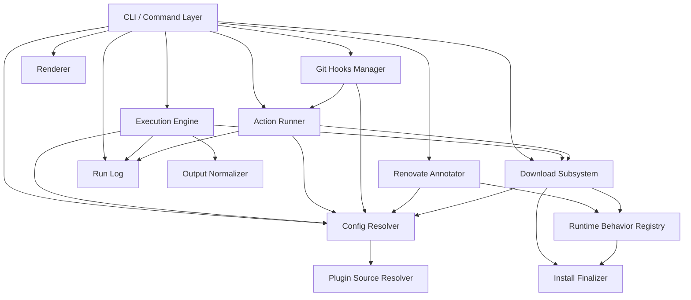
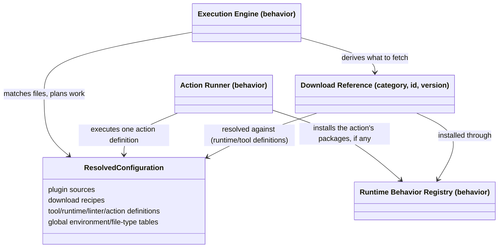

# rtunk architecture

This is the architecture reference for rtunk, written to let a full redesign or reimplementation
be planned from these documents alone. It describes responsibilities, boundaries, and the
reasoning connecting components — not the code that currently realizes them. For product framing
and scope, see [AGENTS.md](../../AGENTS.md) and [ROADMAP.md](../../ROADMAP.md); for CLI/UX
contracts, see [docs/cli.md](../cli.md) and [docs/ux.md](../ux.md).

## Documents

- **This file** — the component map: what a runtime, plugin, linter, tool, action, engine, and
  cache are, and how the components that realize them compose.
- **[plugin-model.md](./plugin-model.md)** — the plugin object model: how a linter, tool, runtime,
  action, and download recipe are declared, how they reference each other, and how trunk.yaml's
  enabled ids select from that catalog.
- **[sources.md](./sources.md)** — how plugins, linters, and runtimes are resolved and downloaded.
- **[flows.md](./flows.md)** — the shared pre-run and run flows behind checking and formatting (and
  their variants: linter fixes, format-before-check, fmt's own modes), how actions work end to end,
  and initializing/removing a repository's configuration.
- **[cache.md](./cache.md)** — the cache subsystem's target design: a single overridable root,
  on-disk layout, key derivation, locking, and index-driven garbage collection.
- **[inconsistencies.md](./inconsistencies.md)** — the refactor's decision log: every open
  incoherence, with a status (accepted, an intentional divergence, roadmap, or an open question),
  evidence, and severity.

## Component map

The **Config Resolver** is the only component with no dependency on any other architectural
component — it is the foundation everything else builds on. The **Install Finalizer** is a tiny
shared primitive (atomically publishing a finished install directory) used by both the download
subsystem and the runtime behavior registry, which cannot depend on each other. The **Output
Normalizer** is standalone, with no dependency on the rest of the system.

## Domain model

The **resolved configuration** is the merged, id-keyed catalog every component below reads from:
plugin sources, download recipes, tool/runtime/linter/action definitions, and the global
environment/file-type tables. What each of those definitions contains and how they reference each
other — a linter's tools, a tool's runtime-or-download binding, an action's triggers, trunk.yaml's
enabled ids selecting from the catalog — is its own object model, in
[plugin-model.md](./plugin-model.md); this diagram only covers the _behavior_ components that
consume that catalog:

### The core design pattern: declared definition vs. interpreting behavior

Every domain concept in rtunk splits cleanly into a **declared definition** — parsed straight out
of the project's configuration and its plugin sources — and the **behavior** that interprets that
definition and acts on it. This split runs through the whole system and is the single most
important thing to preserve, or deliberately renegotiate, in a redesign:

- A **runtime's declared definition** (its download recipe, exposed shim names, environment
  tables) is pure data: one instance per runtime kind that appears in the resolved catalog. The
  **runtime behavior registry** is separate: one behavior entry per supported runtime _kind_
  (`go`, `node`, `python`, `php`, `rust`, `ruby`), each knowing how to install a package through
  that runtime's package manager, what extra shim environment an installed package needs, and
  which upstream package registry tracks its version updates. See
  [sources.md](./sources.md#runtimes).
- The same split exists between a **linter's declared definition** (files it matches, tools and
  commands it names) and the **execution engine**, which interprets that definition into planned,
  running processes; and between an **action's declared definition** and the **action runner**
  that executes it.

A redesign that collapses "what a runtime/linter/action _is_" and "what the system _does_ with it"
into one concept per domain noun would remove this split — worth deciding deliberately, since
keeping declared definitions free of behavior is what makes them cheap to resolve, print, and
inspect without needing any execution machinery at all.

### Major components

- **Config Resolver** — reads the project's configuration, resolves each declared plugin source
  (a local directory, walked directly, or a git-based source, fetched and cached), merges every
  definition every plugin source contributes into one resolved configuration, and trims it down to
  what is actually enabled (plus whatever those enabled definitions reference transitively) unless
  the caller explicitly wants the full, untrimmed catalog. Owns the plugin-source cache. See
  sources.md.
- **Download Subsystem** — turns a reference to one category/id/version into installed bytes on
  disk: resolves the effective version, checks the local install location first (a cache hit needs
  no network access at all), and otherwise fetches — either a content-verified download through a
  transient, hash-verified scratch location, or a package-manager install carried out through the
  runtime behavior registry — then writes the executable shims that expose the result on the search
  path. Owns the on-disk layout of the install/shim cache. See sources.md and cache.md.
- **Runtime Behavior Registry** — one behavior entry per runtime kind, holding everything specific
  to that kind: how to install a package through it, what extra shim environment an installed
  package needs, and which upstream package registry tracks its version updates. Depends on
  nothing else in the system, so it can be queried by both the download subsystem and the
  annotation subsystem without either needing to know a runtime kind's own installation details.
- **Install Finalizer** — a minimal shared primitive: publish a completed installation atomically
  from a scratch location into its final place, treating "already there" (a concurrent install won
  the race) as success rather than conflict. Exists because the download subsystem and the runtime
  behavior registry both need it and neither may depend on the other.
- **Execution Engine** — the core of checking and formatting: matches each linter definition's
  files (gitignore-aware), determines and prefetches every tool/runtime the matched linters need,
  plans one unit of work per runnable command, runs that work concurrently, and streams progress
  and outcome events. Delegates turning raw tool output into a normalized finding to the output
  normalizer.
- **Action Runner** — executes one action definition end to end: resolves whatever runtime/package
  environment it needs (independently of the execution engine — see
  [inconsistencies.md](./inconsistencies.md)), substitutes its invocation template's variables, runs
  it, records its output to the run log, and appends its outcome to a per-repository history.
- **Git Hooks Manager** — installs and removes the shim scripts, at the appropriate git lifecycle
  points, that hand off to the action runner; the set of hook points to wire is derived from every
  currently enabled action's own triggers, not a fixed list, and a hook file not carrying the
  system's own marker is always left untouched.
- **Run Log** — one append-only journal per checking/formatting/action-running invocation:
  environment (secrets redacted by name heuristic), every command's invocation, output (capped and
  flagged if truncated), findings, and outcomes. A disabled or unavailable log is a safe no-op
  everywhere it's consulted, never a reason to fail a run.
- **Output Normalizer** — the common finding shape every per-format output parser (structured
  interchange formats, per-tool native schemas, and configuration-declared patterns) converges on.
- **Renderer** — turns the engine's event stream and run summary into the chosen presentation
  (plain progressive text, a live terminal view, or a machine-readable document); renderers hold no
  business logic, only presentation over the same stream.
- **Renovate Annotator** — generates version-update annotations for pinned entries in the project's
  configuration, resolving an upstream code-hosting location from a tool's download recipe and an
  upstream package registry from the runtime behavior registry. Deliberately never checks or
  applies updates itself — only annotates so an external update tool can.
- **CLI / Command Layer** — the command tree; the only place that wires the config resolver
  together with the execution engine, action runner, download subsystem, git hooks manager,
  renovate annotator, and renderer. Shared entry points (resolving the project's
  configuration file, resolving which files a command should act on) exist so every command
  builds on the same foundation rather than each re-deriving it.

## Known architectural debt

An earlier design pass identified several structural inconsistencies and carried out one of them:
the runtime behavior registry itself (one behavior entry per runtime kind, replacing duplicated
per-kind dispatch that used to be spread across two unrelated subsystems) and the small shared
install-finalizer primitive that came with it. Everything else that pass identified, plus further
issues found since, is catalogued with evidence and severity in
[inconsistencies.md](./inconsistencies.md) — the target shape a redesign should pick up from, rather
than invent from scratch.
