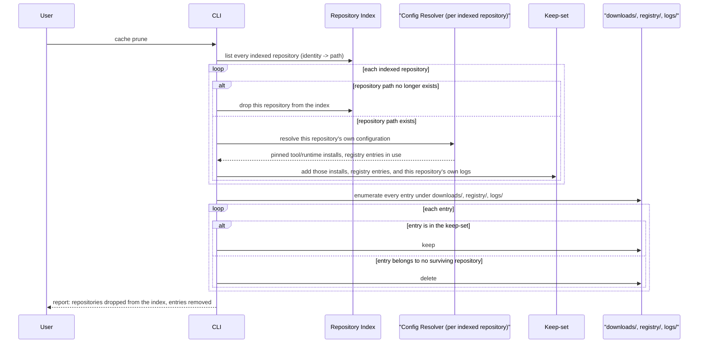

# Cache

The cache is a **single overridable root** with independent, purpose-specific subtrees under it —
one for installed tools/runtimes, one for the plugin-source registry, one for run journals. This
document is the target design: one shared root, transient blob storage, per-target lock files, and
index-driven garbage collection. Where today's behavior still diverges from it, a **Today:** note
says so explicitly; everything else describes the design to build toward.
[inconsistencies.md](./inconsistencies.md) tracks each divergence as a numbered, status-tagged item.

## What gets cached, and why

| Layer | What | Invalidation |
| --- | --- | --- |
| Plugin source definitions | Every linter/tool/runtime/action a remote plugin source contributes, parsed | A configuration-shape version bump invalidates everything; otherwise never — keyed by a pinned location+reference, immutable by construction |
| Plugin source checkout | The full fetched contents of a remote plugin source | Same key as above; regenerated together with the parsed cache if either goes missing or corrupt |
| Tool/runtime installs | Extracted archive or runtime-package-manager install tree | `cache clean` (full wipe) or `cache prune` (index-driven garbage collection — see below) |
| Executable shims | Generated wrapper scripts pointing at an install | Regenerated whenever their install is regenerated; swept alongside it by either command above |
| Run journals | Per-invocation append-only log | An explicit "clean" command; `cache prune` also sweeps a journal belonging to a repository no longer indexed |

**Today:** fetched artifact bytes are additionally persisted forever in a content-addressed blob
store, keyed by their own hash, never invalidated. The target removes this subtree entirely — see
"Blob storage is transient" below.

Lint **results** are not cached at all — every checking/formatting run re-executes every matched
linter's commands; there is no result-level cache keyed by file content or configuration hash
(unlike the upstream tool this project is compatible with, which does cache lint results). The
configuration schema carries an opt-out flag for this, at both the linter level and, far more
commonly in practice, the individual command level — but today neither form changes any behavior:
the linter-level flag is parsed into the resolved configuration and then never consulted again, and
the command-level form is not part of the resolved shape at all, so it is silently dropped while
parsing. This is a deliberate scope gap for the caching feature itself (simply not yet built), but
the flag's own complete inertness — accepted and then ignored rather than rejected or surfaced as
unsupported — is worth calling out on its own; see [inconsistencies.md](./inconsistencies.md).

## On-disk layout (target)

```text
<cache root>/                          # one root: override, or an OS-appropriate default location
├── downloads/
│   ├── installs/<category>/<id>/<version>/<platform>/   # extracted archive or package-manager install tree
│   └── shims/<category>/<id>/<version>/<name>           # generated wrapper script
├── registry/
│   ├── <source identity>.json         # plugin source parsed-definitions cache
│   └── checkouts/<source identity>/   # plugin source persisted checkout
├── logs/<repository identity>/<UTC timestamp>-<command>.jsonl  # run journals
└── index.json                         # repository index: <repository identity> -> repo path (see "Repository index and `cache prune`")
```

`category` is one of tool, runtime, linter, or plugin source. `<source identity>` and `<repository
identity>` are stable, content-derived identifiers (a hash of the source's own location+reference,
and of the repository's own path, respectively) — not human-readable names, so two differently-cased
or differently-pathed references to what is otherwise the same source or repository still collide
predictably.

### Key derivation

- **Install/shim location**: derived purely from category, id, version (and, for an install,
  platform) — no hashing, a direct, predictable path shape. An install is additionally keyed by
  platform, since a hermetically fetched install is platform-specific; a shim is not, being a small
  generated script rather than a platform-specific binary.
- **Plugin source location**: identity-addressed by the source's own pinned location and reference,
  not by content (content is trusted to match once, on first fetch — see sources.md's "Verification
  model" — the same trust model as artifact downloads).

### Blob storage is transient

**Today:** every fetched artifact's raw bytes are additionally published into a permanent,
content-addressed store (keyed by the hash of the bytes themselves), on the theory that two
different download recipes producing byte-identical artifacts could then share one stored copy, and
that a cache hit could be re-verified against its own content later. Neither actually happens: a
cache hit is decided purely by whether the install directory already exists, never by looking
anything up in the blob store by hash — the hash is only known *after* the download completes, so
there is no way to look up "do I already have this artifact" before fetching it. The **only** reader
of a published blob is the extraction step immediately after that same fetch. The store therefore
grows forever, on every cold fetch, for zero benefit over deleting the blob right after extraction.

**Target:** the fetch pipeline still streams every download through a content hash, and still
publishes to a hash-named scratch location only once that hash is fully known (the same
verify-before-trust discipline as today) — but that location is a **temporary scratch area**, deleted
once the artifact has been extracted/copied into its install location. Content hashing is kept for
exactly what it's actually used for: verifying a single fetch as it happens, and (once built) as the
value checked against the planned checksum ledger — see "Trust-on-first-use" in
[inconsistencies.md](./inconsistencies.md), tracked as the `rtunk.lock` roadmap milestone.

## Single cache root

**Target:** one root-resolution, used by every subtree — `downloads/`, `registry/`, `logs/`,
`index.json` — whether the root came from the OS-appropriate default location or an explicit
override. No subtree derives its own idea of where the root is.

**Today:** the download subsystem and the plugin-source cache each independently derive "the cache
root" from the same override value, with **different join conventions**: the download side always
appends its own fixed subdirectory to whatever root it's given; the plugin-source side does the same
only when no override is given, but uses an explicit override value **as-is**, appending no
subdirectory of its own. With the default location the two land as clean siblings by coincidence;
the moment a custom cache root is supplied, that symmetry breaks — downloads land in a subdirectory
of it, but the plugin-source cache's own files land directly in the custom root itself, alongside
(not inside a sibling of) the downloads subdirectory. This is exactly the kind of divergence the
single, shared root-resolution above is meant to prevent by construction. Tracked in
[inconsistencies.md](./inconsistencies.md).

**Today**, relatedly: the plugin-source registry is never swept by anything — there is no command
whose scope reaches it at all. The target's unified `cache clean`/`cache prune` (below) close this by
construction, since both operate on the whole root rather than a downloads-only subtree.

## Locking

**Target:** during the fetch-and-install of an item, a lock file is created atomically (an
exclusive-create operation that fails if the file already exists) at the lowest level, in/next to the
target being written (an install directory, a plugin-source checkout directory, ...). The lock
records at least the owning process id and the identity of the repository that triggered the fetch.
It is removed once the item is fully downloaded **and** installed. When another process encounters an
existing lock:

- **The recorded process id no longer exists on the host** → the lock is stale: delete it and proceed
  with the fetch normally.
- **The recorded process is still alive** → stop immediately with an error naming which repository is
  currently fetching which item, and that the user should retry later. **No waiting, no retry loop.**

This is a real, cross-process, filesystem-level lock, scoped to the one target being written, not a
single in-memory coordination point.

**Today:** every coordination mechanism protecting the cache from concurrent writers (serializing
same-runtime installs, treating a losing checkout-publish race as success) is scoped to one running
process's own in-memory state; two entirely separate processes racing to populate the same cache
entry are not coordinated at all beyond the atomic-publish guarantee each write already has on its
own (which prevents corruption, not duplicated work). Tracked in
[inconsistencies.md](./inconsistencies.md).

**Accepted limitation:** liveness is checked by process id alone, which has two known blind spots — a
reused pid can make a genuinely stale lock look alive (an unrelated process now happens to hold that
id), and a lock cannot be checked for liveness at all when the cache is shared over a network
filesystem from a different host than the one that created it. Both are accepted for now, not solved
by this design.

## Consistency guarantees and assumptions

- **Every cache write is atomic**: parsed plugin-source definitions, a plugin source's persisted
  checkout, and a completed install all follow the same shape — do the work in a scratch location,
  then publish it into its final place in one atomic step only once every step has already
  succeeded. A crash mid-write can never leave a half-written file or directory that a later run
  mistakes for a valid cache hit.
- **Existence, not content, is the install cache-hit signal**: whether an install location already
  holds something is the entire cold/warm decision for a tool or runtime — there is no
  re-verification of previously fetched content on a warm hit. This is sound precisely *because*
  every install location is only ever populated by that same atomic publish step, never written to
  in place — the same guarantee that lets "the destination already exists" be treated as "a
  concurrent or earlier install already finished" rather than a conflict.
- **A configuration-shape version mismatch is a hard miss, not a soft one**: the plugin-source
  cache's version tag is checked on every read; skipping that check when the configuration shape
  gains a new field is exactly what has caused real, silent bugs in this project's own history — a
  stale cache from before a field existed simply decodes that field as empty, which looks like a
  normal, valid hit unless the version check catches it.
- **Today:** content-addressing is additionally treated as implying indefinite, cross-recipe reuse is
  always safe (two different download recipes producing byte-identical artifacts transparently share
  one stored copy, forever). The target's transient blob storage (above) intentionally gives this up
  — an accepted trade-off against a store that never actually served a lookup, not a regression to
  guard against.

## Repository index and `cache prune`

**Target:** one shared cache root can serve many different project repositories (the default,
OS-appropriate location is exactly this case). The **repository index** is a single cache-level
mapping from each repository's identity to its filesystem path, updated every time rtunk runs in
that repository. `cache prune` uses it to garbage-collect everything in the cache that no currently-
existing, currently-configured repository still needs — a mark-and-sweep pass, not an age heuristic:



This is the mechanism that makes sweeping the plugin-source registry safe: an entry survives exactly
when some still-existing, still-configured repository still resolves to it, regardless of which
subtree (downloads or registry) it lives in.

**Command set this implies**: `cache clean` (unconditional full wipe of the whole cache root — the
target replacement for today's separate "destroy everything" and age-based "prune" commands) and
`cache prune` (the index-driven garbage collection above — a new command, not a rename of today's
age-based prune, which this design replaces rather than refines).

## How it plugs into the rest of the system

- Every component that needs a path within the cache resolves the single shared root once and reads
  the appropriate subtree under it — see "Single cache root" above.
- The cache-administration commands (`clean`, `prune`) and the run log's own root resolution all
  build on that same single resolution, so there is exactly one authority for "where is the cache,"
  not one de facto authority (the download subsystem) with a documented gap (the plugin-source
  registry) beside it.
