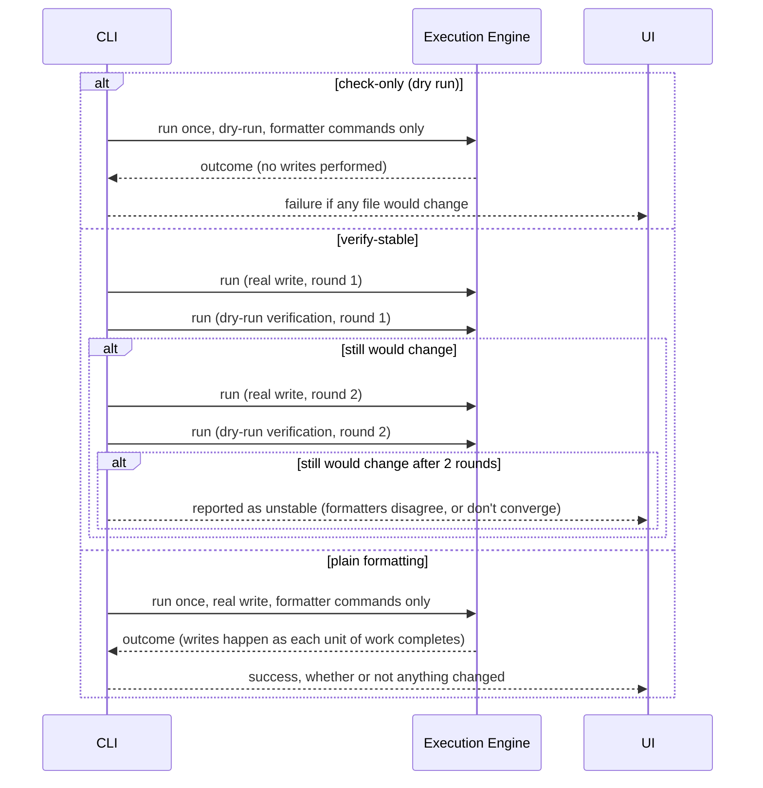
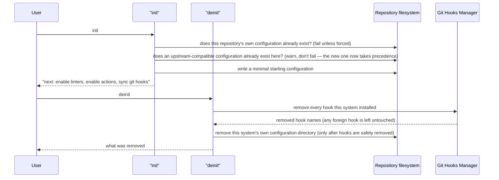

# Flows

End-to-end interaction sequences for rtunk's architecturally significant behaviors, described at
the level of components and responsibilities. Two flows cover checking and formatting between them:
a shared **pre-run flow** (config validation, file selection, linter matching, provisioning) feeds a
shared **run flow** (executing selected commands and handling their output), with checking and
formatting as variants of the same run flow rather than two separate pipelines. Actions and
init/deinit are their own, unrelated flows, covered separately below.

The output side of every diagram below is a single **UI** participant — the presentation layer
(plain text, a live view, a machine-readable document) is a UX concern with its own contract; see
[docs/cli.md](../cli.md) and [docs/ux.md](../ux.md) for what it actually renders.

## Pre-run flow

Shared by every command that acts on a resolved configuration and a set of files (checking,
formatting). Produces: a resolved, validated configuration; the files to act on; which enabled
linters match which of those files; and every tool/runtime those linters need, installed and ready.

```mermaid
sequenceDiagram
    participant User
    participant CLI
    participant Config as Config Resolver
    participant Engine as Execution Engine
    participant Download as Download Subsystem

    User->>CLI: check|fmt [paths...]
    CLI->>Config: resolve project configuration
    Config->>Config: merge every plugin source's definitions (local: read directly; remote: cached, see sources.md)
    Config->>Config: validate: legacy single-command linter shape present? refuse (see inconsistencies.md)
    Config->>Config: validate: a still-enabled id is marked deprecated? warn, keep resolving
    Config->>Config: resolve one exact, fully pinned version per enabled tool/runtime (never a range)
    Config->>Config: narrow each linter's declared commands to the resolved version and host platform<br/>(a platform-only variant for an unsupported platform is discarded; a version-range<br/>variant is kept only if its range contains the resolved version)
    Config-->>CLI: resolved, validated configuration
    CLI->>CLI: select files (see "File selection" below)
    loop each enabled linter
        CLI->>Engine: match this linter's files against its declared file types (gitignore-aware)
    end
    CLI->>Download: provision every matched linter's tools/runtimes
    loop each tool/runtime needed
        Download->>Download: acquire a lock at its install location (fail fast if already locked)
        alt already installed
            Download->>Download: release lock, already cached
        else not installed
            Download->>Download: fetch and install (see sources.md's cold/warm path), release lock
        end
    end
    Download-->>CLI: every needed tool/runtime ready, or a failure
```

Nothing in this flow is written to the run journal, by design — file selection and provisioning are
deliberately outside the journal's scope, not merely unimplemented; see "install events and file
selection are deliberately not logged" in [inconsistencies.md](./inconsistencies.md).

### File selection

| Context                                                 | No paths given (default)                                                                                                                                                                  | Explicit paths given                                                         |
| ------------------------------------------------------- | ----------------------------------------------------------------------------------------------------------------------------------------------------------------------------------------- | ---------------------------------------------------------------------------- |
| Outside a git repository                                | No default selection — an explicit validation error naming the requirement, not a silent no-op.                                                                                           | Used exactly as given; gitignore cannot be applied (no git to ask).          |
| Inside a git repository, current branch has an upstream | Every file changed between the upstream branch's merge-base and the working tree, plus untracked, non-ignored files.                                                                      | Listed through git (so gitignore applies), intersected with the given paths. |
| Inside a git repository, no upstream                    | Every file with a staged change, every file with an unstaged change, and every untracked, non-ignored file — everything that differs from the last commit, tracked or not, staged or not. | Listed through git (so gitignore applies), intersected with the given paths. |

Implemented as of v0.10 (`internal/cli/shared.go`); see
[inconsistencies.md](./inconsistencies.md) entries #19 and #20.

## Run flow

Shared by every variant of checking and formatting. The pipeline is identical across all of them;
**only two things vary per variant**: which of a linter's already-narrowed commands are selected, and
what happens with each selected command's output (a finding to report, or a file to rewrite).

```mermaid
sequenceDiagram
    participant User
    participant CLI
    participant Log as Run Log
    participant Engine as Execution Engine
    participant Work as Planned Work
    participant Normalizer as Output Normalizer
    participant UI

    CLI->>Log: run_start
    loop each linter with matched files
        CLI->>Engine: select this variant's commands from the linter's narrowed command set
        Engine->>Engine: plan one unit of work per selected command
        Engine-->>UI: work planned (count, whether batched)
    end
    par concurrent workers
        Engine->>Work: carry out one planned unit of work
        Work->>Log: invocation (argv, cwd, PATH prefix)
        Work->>Work: run the command
        Work->>Log: output (stdout/stderr)
        Work->>Log: exit (code, duration)
        opt the command declares an output parser
            Work->>Work: convert raw output through the parser sub-invocation
            Work->>Log: parser (sub-invocation argv, exit, duration)
        end
        Work->>Normalizer: convert parsed output into normalized findings
        Work->>Log: findings
        alt this variant writes files for this command (formatter, or a fix command)
            Work->>Work: rewrite the target file(s); compare before/after content to report what changed
        else this variant only reports (a checking command)
            Work->>Work: findings carried through; nothing written
        end
        Work-->>Engine: outcome (done, skipped, or failed)
        Engine->>Log: linter_end
        Engine-->>UI: forward outcome
    end
    CLI->>Log: run_end
    UI-->>User: progress (as it happens) + findings/changed-files report (on completion)
```

**Per-linter failure isolation** holds across every variant: one linter failing does not stop the
others; outcomes accumulate across the whole stream, and the overall result is decided only once the
stream closes.

### What each variant selects

| Variant                       | Commands selected                                                              | Output handling                                                                                                                                                                                              |
| ----------------------------- | ------------------------------------------------------------------------------ | ------------------------------------------------------------------------------------------------------------------------------------------------------------------------------------------------------------ |
| `check` (plain)               | Checking commands only — never a formatter, never a fix command.               | Findings reported; nothing written.                                                                                                                                                                          |
| `check --fix`                 | Checking commands, plus every non-formatter **fix** command a linter declares. | Findings from the checking commands; any finding carrying its own inline autofix (see below) is applied; each fix command's rewrite is applied; a second, plain-checking pass then reports whatever remains. |
| `check --format-before-check` | Formatter commands, then checking commands.                                    | The formatter pass writes files; the checking pass that follows reports remaining findings against the now-reformatted files.                                                                                |
| `fmt`                         | Formatter commands only.                                                       | Files rewritten; see fmt's own dry-run/stability modes below.                                                                                                                                                |

`check --fix` and `check --format-before-check` are each two runs of this same pipeline in sequence
— a writing pass, then a plain-checking pass over the result — not a different pipeline.
Implemented as of v0.10; see "fix vs. formatter conflation" in
[inconsistencies.md](./inconsistencies.md).

**Finding-level autofixes**, applied under `check --fix` above: some structured output formats let a
finding carry its own replacement text inline — the tool already computed exactly what the fixed
line should read, attached to the finding itself, with no separate fix command involved (a real,
common shape: several linters, including eslint/ruff-style ones for their auto-fixable rules, report
findings this way). Applying one means rewriting the affected file with the finding's own payload,
the same "write the result" step a fix command's own output would go through.

### `fmt`'s own modes

`fmt` runs the shared pipeline above, restricted to formatter commands, with three variations on how
many times and how it runs it:



Stability verification exists because two formatters can disagree with each other (one reformats
what another's automatic fix just wrote, and vice versa): it alternates a real write round with a
dry-run verification round, up to two real rounds, and reports the result as unstable rather than
silently leaving a file in a state a third round would still change. `fmt` also skips partially
staged files by default (rewriting one in the working tree would leave the index out of sync with
what the user staged) unless explicitly forced.

## How actions work

An action is not matched against files the way a linter is — it fires from a **trigger**. The only
trigger kind rtunk supports is a git hook name: a file-change glob and a periodic schedule are both
real, declarable trigger kinds in the schema, and both are refused at configuration validation (the
same validation step the pre-run flow already runs) — supporting either would require rtunk to run as
a background daemon, watching for file changes or waiting out an interval, which rtunk refuses by
design. Refusal applies to any action declaring an unsupported trigger kind, whether that is its only
trigger or one alongside a supported git-hook trigger.

```mermaid
sequenceDiagram
    participant User
    participant CLI
    participant Config as Config Resolver
    participant Hooks as Git Hooks Manager
    participant Resolve as "Actions relevant to a trigger" query
    participant Git as "git (native)"
    participant Runner as Action Runner
    participant Download as Download Subsystem
    participant Log as Run Log
    participant History as Action History

    User->>CLI: enable an action id
    User->>CLI: sync git hooks
    CLI->>Config: resolve configuration
    CLI->>Resolve: which git-hook names does any enabled action's trigger name?
    Resolve-->>CLI: hook name set
    CLI->>Hooks: install one shim script per hook name (marker-tagged; a foreign hook file is left untouched)
    Hooks-->>User: hooks installed

    Git->>Hooks: invoke the installed shim at a lifecycle point (e.g. before a commit)
    Hooks->>CLI: run actions for this hook point, forwarding git's own arguments
    CLI->>Resolve: which enabled actions trigger on this hook point?
    Resolve-->>CLI: matching action definition(s)
    loop each matching action
        CLI->>Runner: run(action definition)
        alt action declares a runtime
            Runner->>Download: resolve (fetch if needed) that runtime's shim location
            Download-->>Runner: shim location
        end
        Runner->>Runner: substitute the invocation template's variables (hook point, working directory, trigger arguments, ...)
        Runner->>Runner: run the substituted invocation
        Runner->>Log: invocation, output, exit
        Runner->>History: append the outcome (best-effort; never fails the run)
        Runner-->>CLI: outcome
    end
    CLI-->>Git: success (every action ok), or failure (any action failed)
```

The action runner resolves its own runtime shim location, and substitutes its own invocation
template's variables, independently of the execution engine — see
[inconsistencies.md](./inconsistencies.md).

**Today:** neither unsupported trigger kind is refused. Both a file-change trigger and a schedule
trigger are silently parsed and then never consulted by anything — the query above that resolves
"which actions fire on this trigger" only ever matches the git-hook trigger kind — so an action
relying on either quietly never fires, with no indication why, rather than being caught at
configuration validation as the target above requires. Tracked in
[inconsistencies.md](./inconsistencies.md).

## Initializing / removing a repository's configuration

Small but worth recording on its own, since it is the one flow that reaches into the git hooks
manager from outside a fully resolved configuration — there may not be one yet:



Removing hooks always runs _before_ removing the configuration directory: a repository that only
ever used the upstream-compatible configuration path (the system's primary drop-in use case) can
still have an installed hook, and if hook removal fails partway, the user keeps their configuration
rather than losing both the configuration and a working hook at once.
