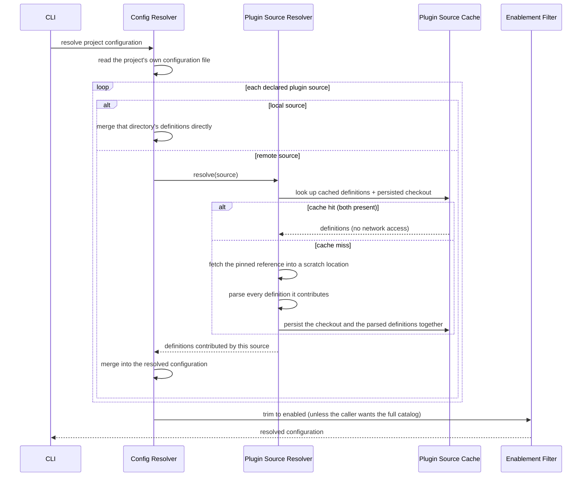

# Sources: plugins, linters, runtimes, downloads

How rtunk's inputs are modeled, resolved, and fetched, at the architecture level: what each
concept means, how definitions flow from plugin sources into one resolved configuration, and how
that configuration turns into installed binaries on disk. Field-by-field configuration syntax is
documented separately, alongside the configuration schema itself; this document covers the
resolution and fetch architecture built on top of it.

## Two-layer resolution: project configuration + plugin sources

The project's own configuration file only **enables** ids, optionally pinned to a version. It
carries no definitions of its own. A list of plugin sources points at one or more plugin
repositories that supply the actual definitions — linters, tools, runtimes, actions, and download
recipes. Each source is one of:

- **Local** — a directory relative to the project's configuration, walked directly on every
  resolution, with no caching.
- **Remote (git-based)** — identified by a repository location and a pinned reference (always a
  tag or a fixed commit, never a moving branch, for reproducibility). Fetched once and cached; see
  "Plugin source resolution & caching" below.

Resolving "what's enabled" trims every definition category down to what's enabled plus what those
enabled definitions reference transitively, in stages: enabled linters/actions first, then the
tools and file types they reference, then the runtimes referenced by those plus the linters/
actions themselves, then the download recipes referenced by those runtimes and tools. Resolving
"the full catalog" (used to print every available definition, matching the upstream tool's own
behavior) skips that trim entirely. A small set of genuinely global configuration — shared
environment tables and comment-format definitions used to recognize inline ignore directives — has
no enabled/disabled id of its own and is identical either way.

### Plugin source resolution & caching

Caching is keyed by the source's own identity — its location plus its pinned reference — since a
pinned reference never changes content, making a cache hit safe to reuse indefinitely. Two
artifacts share that identity:

- **Parsed definitions** — a small, versioned record of everything the source contributes,
  written atomically so a crash mid-write can never leave a half-written file mistaken for a valid
  hit. The version tag exists because a configuration shape that grows a new field after a cache
  was written must be treated as a miss, not a silently under-populated hit — this has concretely
  happened more than once in this project's own history.
- **The persisted checkout itself** — not just fetched and discarded, so template variables that
  resolve into a plugin's own directory tree (for example, a converter script a linter definition
  ships alongside its own metadata) have real files to read even on a fully warm run that never
  touches the network again.

A cache hit requires **both** artifacts present — parsed definitions at the current version, and
the checkout directory still existing. Either one missing regenerates both together from a fresh
fetch, published atomically once complete. A losing race between two processes cold-fetching the
same source at once is treated as success rather than a conflict, since both fetches are
guaranteed to produce identical content given the same pinned reference.

## Linters

A linter definition ties together:

- **Matched file types** — ids into the resolved file-type registry, not raw glob patterns. File
  types compose (one type can extend another) and matching considers extensions, filenames,
  regular expressions, and interpreter lines, then filters out anything the repository's own
  ignore rules exclude.
- **The tool(s) it invokes** — see "Tools" below.
- **One or more command definitions** — a checking and/or formatting invocation, each declaring a
  supported tool-version range and/or a restriction to specific host platforms, so a linter with
  several same-named command variants (a real, common catalog shape: a linter whose newer and
  older major tool versions use genuinely different configuration conventions and need different
  invocations, or whose Windows invocation differs from every other platform's) narrows to exactly
  one variant per resolved tool version and host platform. **This narrowing is declared in the
  schema but not currently applied by the execution engine**: every declared command variant for a
  matched linter is treated as applicable regardless of the resolved tool's version or the host
  platform, which for a linter with several version- or platform-gated variants of the same command
  name means more than one variant runs where only one should. This narrowing is applied at
  command-selection time (v0.10, `pkg/trunk/engine`): the first declared variant whose version
  range and platform restriction both admit the resolved tool version and host wins, matching every
  other variant-selection logic in this codebase (`download.MatchEntry`'s own first-match
  semantics). See [inconsistencies.md](./inconsistencies.md).
- **Config file presence** — files whose presence enables or influences the linter, also used to
  decide where a command actually runs from when several matched files share a common context.

### Output parsing

A command definition can name an output parser: a secondary script that converts a tool's native,
unstructured output into the system's normalized shape, for tools with no built-in structured
output mode. This lets the normalization step treat every tool uniformly downstream regardless of
what format it naturally produces.

## Tools

A tool definition is fetched one of two mutually exclusive ways:

- **Through a runtime's package manager** — naming the runtime kind and a package identifier; see
  "Runtimes" below.
- **Through a download recipe** — a reusable, OS/CPU-templated fetch description, for standalone
  binaries with no runtime dependency.

Every tool definition names the executable name(s) it exposes once installed (optionally aliasing
an exposed name to a different underlying binary), and a default/pinned version used whenever
nothing in the project's own configuration pins a different one.

## Runtimes

A runtime's **declared definition** describes a language runtime: how to obtain it (a download
recipe, or an instruction to expect it already present on the host, verified by inspecting its
reported version), which executables it exposes, and two environment tables — one for running the
runtime itself, one added specifically when a tool that depends on it executes (for example,
exposing that tool's own package-local executables on the search path).

The **behavior** half — how to actually install a package through that runtime's package manager —
is organized as one behavior entry per runtime kind:

| Runtime kind | Package install mechanism                                                                                                 | Upstream registry tracked |
| ------------ | ------------------------------------------------------------------------------------------------------------------------- | ------------------------- |
| go           | its native module-install command (with a version-string adjustment for its `v`-prefixed tags)                            | its module proxy          |
| node         | its native package-install command (also supports installing every dependency of a manifest file at once)                 | its package registry      |
| python       | its native package-install-to-prefix command (installed packages need an extra interpreter search-path environment entry) | its package index         |
| php          | its dependency-manager's require command                                                                                  | its package registry      |
| rust         | its native crate-install command                                                                                          | its crate registry        |
| ruby         | its native gem-install command                                                                                            | (none tracked)            |

A runtime kind absent from this registry (for example, one not yet supported at all) is reported
as "not yet supported" wherever it's looked up. Adding a new runtime kind means adding one new
behavior entry; nothing else in the system needs to know its name — both the download subsystem
and the renovate annotator dispatch purely by looking the kind up in this registry.

## Download mechanism

### References and fetch events

A download reference names one fetch target: a category (tool, runtime, linter, or plugin source), an
id, and a version. Fetching a batch of references fans a bounded amount of parallelism across each
one; a "linter" reference simply expands to the references of the tools that linter needs (a linter
has no binary of its own to fetch). Every fetch reports its own progress as a small sequence of
phases — already cached, started, in-progress with byte counts, done, or failed — which is the same
event vocabulary the execution engine forwards into its own progress stream when it triggers a fetch
on a user's behalf (see flows.md).

**An action has no download category of its own**: provisioning an action is entirely a matter of
provisioning whatever runtime it declares (or nothing, if it declares none) — the same runtime
category every tool provisioning already goes through, not a distinct fetch-target kind. Today, a
separate action fetch category exists and only ever delegates straight to the runtime category,
which is a redundant extra category rather than a real distinction; see
[inconsistencies.md](./inconsistencies.md).

### Cold vs. warm path (tools and runtimes)

Both a tool fetch and a runtime fetch resolve the effective version first (the project's own pin,
if any, otherwise a default), then check the local install location for an existing, non-empty
result _before_ doing any network activity at all:

- **Warm (cache hit):** the install location already holds a result → reported as already cached,
  returned immediately. No network call, no re-verification of previously fetched content.
- **Cold (cache miss):**
  - **Download-recipe-based** (a standalone binary): the matching OS/CPU download entry is
    selected, its URL is filled in with the resolved version and platform, the artifact is fetched
    and content-verified (see "Verification model" below), then extracted or copied into a scratch
    location and published atomically into its final install location. Executable shims are then
    written for each exposed name.
  - **Runtime-package-based** (a tool installed through a runtime's package manager): the runtime
    itself is fetched first if not already cached (the same cold/warm check, recursively), then
    the package is installed through that runtime kind's own package-manager behavior, then
    package-local executable shims are written carrying whatever extra environment that runtime
    kind's behavior entry says an installed package needs.
- **Runtime installs are additionally serialized**: several tools needing the same runtime,
  fetched at once, all wait for one real install to finish rather than racing to install the same
  runtime concurrently; the rest then observe it already cached.

See flows.md for the full interaction sequences (cold and warm) and cache.md for the on-disk
layout and verification model this all reads and writes.

### Verification model

Every artifact fetch is restricted to secure transport (a plain, unencrypted connection to a real
host is refused outright; only a local loopback exception exists, for test environments), streamed
through a content hash as it downloads, and only published to its final, hash-named location once
that hash is fully known — a location is never read unless its name matches its own content.
There is, however, **no independently-supplied checksum** to verify a freshly fetched artifact
against: the model is trust-on-first-use — the first fetch of a given artifact is accepted as
authoritative, and a source compromised at exactly that moment would not be detected. A future,
explicitly planned hardening step is a version-pinned checksum ledger, checked in alongside the
project's own configuration, so a later mismatch becomes a hard, blocking error instead of a
silent re-trust.

## Actions

An action definition is a git-hook-triggered or file-change-triggered automation: an optional
runtime kind it runs under, an invocation template (which can reference trigger-supplied arguments
and a temporary file holding the hook's own standard input), a set of alternative triggers (a list
of git hook names, a list of file-change globs, or a periodic schedule — schedules are otherwise
inert, since the system deliberately has no background process to act on them), whether it needs
an interactive terminal, and whether a failure should raise a desktop notification.

A single shared query goes from "the currently enabled action set" to "actions relevant to a given
git hook name" — both the git hooks manager (deciding which hook points need a shim script at all)
and the action-running/listing commands build on that same query, so the hook name set stays
correct as the enabled action set changes, with no separately maintained list to fall out of sync.
